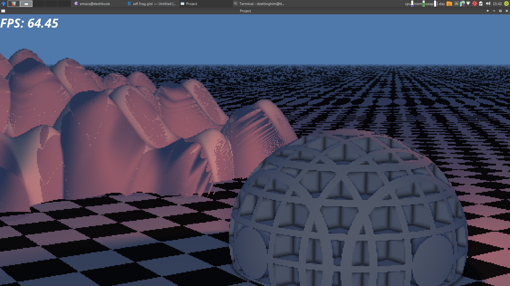
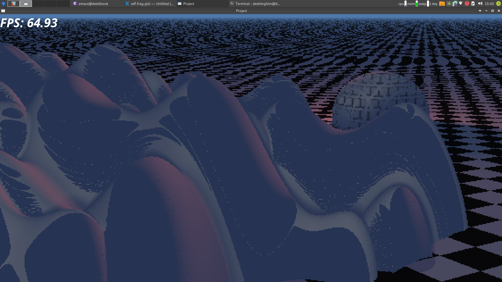

# kha-sdf
Figuring out Signed Distance Field rendering with Kha

Signed Distance Function are cool. Check out 
[Inigo Quilez's](http://www.iquilezles.org/) articles on them. That's what most 
of this is based on. I did get stuck with some of the more general descriptions
given, so I ended up doing a rewrite based on 
[9bitscience's article and example code.](https://9bitscience.blogspot.com/2013/07/raymarching-distance-fields_14.html) 
In any case, this is an implementation in haxe and kha, for learning purposes.

## What I Learned
* Repeating the exact some object on a grid is super cheap
* Raymarching SDFs is not the same as raymarching terrain
* SDF Raymarching quickly gets slower with unique objects
** Edges are the real enemy in this case
* Lowering the resolution can drastically improve performance

## Running

Install kode studio, open the folder as a project, hit run. Hopefully. I wasn't 
exactly aiming for a reproducible build here.

## Future plans
Voxels. I'll probably be borrowing a lot of ideas from [VoxelQuest](https://www.voxelquest.com/)
and [Dreams](http://dreams.mediamolecule.com/). I'm thinking of using voxels for the rendering, 
but storing the data as SDF edits to a voxel field. Which is a lot like how Dreams
works, but it is a really awesome approach so can you really blame me?

## Screenshots

